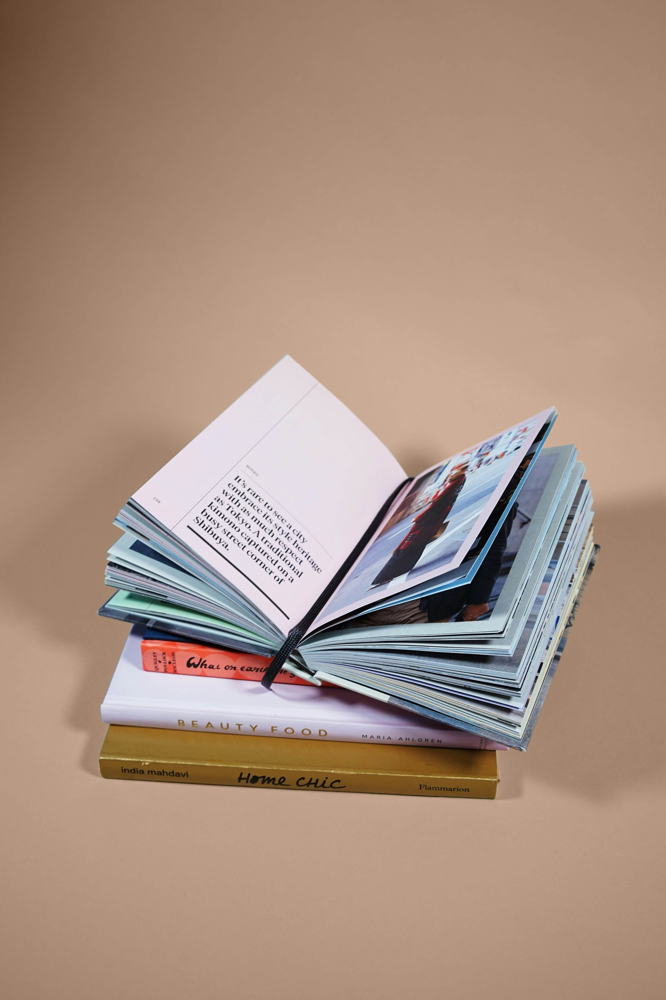

<section class="py-12 bg-gray-100 min-h-screen">
    

        <h1 class="text-5xl font-bold text-center mb-12 text-indigo-700">Fiction Books</h1>
        
        <!-- Reading Assistive Technologies Toolbar -->
        

            <h2 class="text-2xl font-bold mb-4">Reading Assistive Tools</h2>
            

                <button id="text-to-speech" class="bg-indigo-600 hover:bg-indigo-700 px-4 py-2 rounded-lg flex items-center">
                    <svg xmlns="http://www.w3.org/2000/svg" class="h-5 w-5 mr-2" fill="none" viewBox="0 0 24 24" stroke="currentColor">
                        <path stroke-linecap="round" stroke-linejoin="round" stroke-width="2" d="M15.536 8.464a5 5 0 010 7.072m2.828-9.9a9 9 0 010 12.728M5.586 15H4a1 1 0 01-1-1v-4a1 1 0 011-1h1.586l4.707-4.707C10.923 3.663 12 4.109 12 5v14c0 .891-1.077 1.337-1.707.707L5.586 15z" />
                    </svg>
                    Text-to-Speech
                </button>
                

                    <label for="font-size" class="mr-2">Font Size:</label>
                    <select id="font-size" class="bg-gray-700 rounded px-2 py-1">
                        <option value="normal">Normal</option>
                        <option value="large">Large</option>
                        <option value="x-large">Extra Large</option>
                    </select>
                

                

                    <label for="font-family" class="mr-2">Font:</label>
                    <select id="font-family" class="bg-gray-700 rounded px-2 py-1">
                        <option value="default">Default</option>
                        <option value="dyslexic">OpenDyslexic</option>
                        <option value="sans-serif">Sans-serif</option>
                    </select>
                

                <button id="high-contrast" class="bg-indigo-600 hover:bg-indigo-700 px-4 py-2 rounded-lg flex items-center">
                    <svg xmlns="http://www.w3.org/2000/svg" class="h-5 w-5 mr-2" fill="none" viewBox="0 0 24 24" stroke="currentColor">
                        <path stroke-linecap="round" stroke-linejoin="round" stroke-width="2" d="M20.354 15.354A9 9 0 018.646 3.646 9.003 9.003 0 0012 21a9.003 9.003 0 008.354-5.646z" />
                    </svg>
                    High Contrast
                </button>
                <button id="summarize" class="bg-indigo-600 hover:bg-indigo-700 px-4 py-2 rounded-lg flex items-center">
                    <svg xmlns="http://www.w3.org/2000/svg" class="h-5 w-5 mr-2" fill="none" viewBox="0 0 24 24" stroke="currentColor">
                        <path stroke-linecap="round" stroke-linejoin="round" stroke-width="2" d="M9 12h6m-6 4h6m2 5H7a2 2 0 01-2-2V5a2 2 0 012-2h5.586a1 1 0 01.707.293l5.414 5.414a1 1 0 01.293.707V19a2 2 0 01-2 2z" />
                    </svg>
                    Summarize
                </button>
            

        

        
        <!-- Book List -->
        

            <!-- Book 1 -->
            

                
                

                    <h3 class="text-2xl font-bold mb-2">The Night Travelers</h3>
                    
by Rebecca Solnit

                    
A captivating tale of mystery and adventure that follows a group of travelers on a journey through a magical world that only appears at night.

                    

                        <button class="read-sample bg-indigo-600 hover:bg-indigo-700 text-white px-4 py-2 rounded-lg">Read Sample</button>
                        <button class="add-to-list bg-gray-200 hover:bg-gray-300 px-4 py-2 rounded-lg">+ Reading List</button>
                    

                

            

            
            <!-- Book 2 -->
            

                
                

                    <h3 class="text-2xl font-bold mb-2">The Echo of Old Books</h3>
                    
by Barbara Davis

                    
A rare book dealer discovers that some volumes hold more stories than those printed on their pages, including secrets about her own past.

                    

                        <button class="read-sample bg-indigo-600 hover:bg-indigo-700 text-white px-4 py-2 rounded-lg">Read Sample</button>
                        <button class="add-to-list bg-gray-200 hover:bg-gray-300 px-4 py-2 rounded-lg">+ Reading List</button>
                    

                

            

            
            <!-- Book 3 -->
            

                
                

                    <h3 class="text-2xl font-bold mb-2">The Invisible Library</h3>
                    
by Genevieve Cogman

                    
Professional spy Irene works for a mysterious library that collects important fiction from different realities, stepping into a tangled web of danger.

                    

                        <button class="read-sample bg-indigo-600 hover:bg-indigo-700 text-white px-4 py-2 rounded-lg">Read Sample</button>
                        <button class="add-to-list bg-gray-200 hover:bg-gray-300 px-4 py-2 rounded-lg">+ Reading List</button>
                    

                

            

            
            <!-- Book 4 -->
            

                
                

                    <h3 class="text-2xl font-bold mb-2">The Starless Sea</h3>
                    
by Erin Morgenstern

                    
Graduate student Zachary discovers a mysterious book in the library that contains stories about himself, leading him to an ancient underground library.

                    

                        <button class="read-sample bg-indigo-600 hover:bg-indigo-700 text-white px-4 py-2 rounded-lg">Read Sample</button>
                        <button class="add-to-list bg-gray-200 hover:bg-gray-300 px-4 py-2 rounded-lg">+ Reading List</button>
                    

                

            

            
            <!-- Book 5 -->
            

                
                

                    <h3 class="text-2xl font-bold mb-2">The Book of Lost Names</h3>
                    
by Kristin Harmel

                    
A young woman helps Jewish children escape Nazi-occupied France by forging identity documents, secretly preserving their real names in a coded book.

                    

                        <button class="read-sample bg-indigo-600 hover:bg-indigo-700 text-white px-4 py-2 rounded-lg">Read Sample</button>
                        <button class="add-to-list bg-gray-200 hover:bg-gray-300 px-4 py-2 rounded-lg">+ Reading List</button>
                    

                

            

            
            <!-- Book 6 -->
            

                
                

                    <h3 class="text-2xl font-bold mb-2">The Library of the Unwritten</h3>
                    
by A.J. Hackwith

                    
The librarian of Hell's library must track down a missing character from an unfinished book who has escaped into the human world.

                    

                        <button class="read-sample bg-indigo-600 hover:bg-indigo-700 text-white px-4 py-2 rounded-lg">Read Sample</button>
                        <button class="add-to-list bg-gray-200 hover:bg-gray-300 px-4 py-2 rounded-lg">+ Reading List</button>
                    

                

            

        

    

</section>

<!-- Reading Sample Modal -->

    

        

            <h2 class="text-2xl font-bold" id="modal-title">Book Title</h2>
            <button id="close-modal" class="text-2xl">&times;</button>
        

        

            

                The library was not what Zachary expected. It was smaller than he'd imagined, tucked away in a forgotten corner of the university. The shelves stood in neat rows, their wooden frames gleaming with polish. The smell of old paper and binding glue hung in the air.
            

            

                He moved quietly, his footsteps muffled by the carpet. The librarian, an elderly woman with silver hair, nodded to him from behind her desk. Zachary nodded back and continued deeper into the stacks.
            

            

                What he sought was specific—a book he had only heard about in whispers. A rare edition, they said, with a bee on its cover. He wasn't sure why he was so drawn to it, but something about the description had caught his attention and wouldn't let go.
            

            

                The rare books section was cordoned off with a velvet rope. Zachary hesitated, then ducked under it when he was sure no one was watching. The shelves here were older, the books more worn. His fingers trailed along the spines, feeling the texture of leather and cloth.
            

            

                And then he saw it—tucked between two larger volumes, a slim book with a faded golden bee embossed on its spine. His heart raced as he carefully pulled it from the shelf.
            

            

                The moment his fingers touched the cover, he felt a strange sensation, as if the book was humming with its own energy. Zachary quickly looked around, but he was alone among the shelves. With careful movements, he opened the book to a random page.
            

            

                What he read made his blood run cold. There, in precise black lettering, was a story about a boy finding a painted door in an alley. A door he chose not to open. A choice Zachary had made himself, years ago. A moment no one else could possibly know about.
            

            

                His hands trembled as he turned to the next page, wondering what other secrets this mysterious book might contain.
            

        

    

 